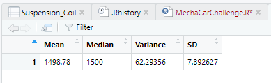
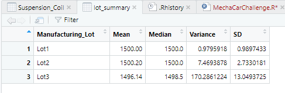
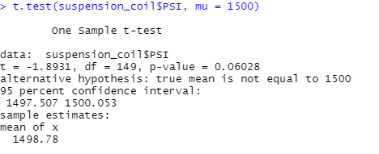
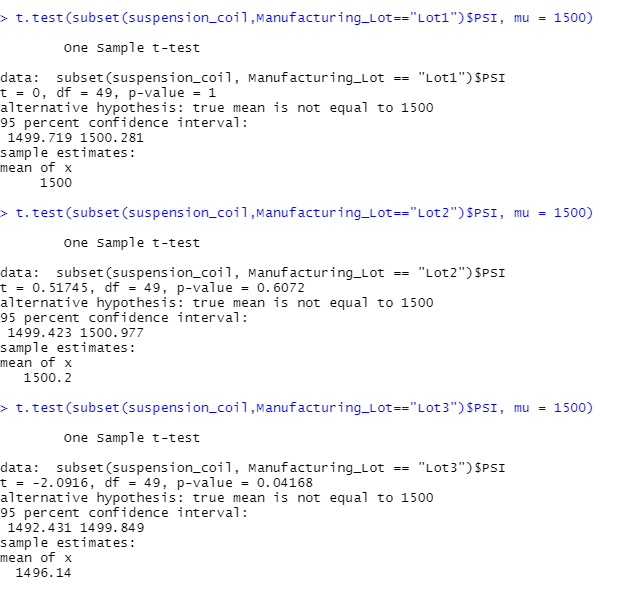

# MechaCar Statistical Analysis
 The data analytics team at AutosRUs are conducting a special project on the production of the MechaCar, AutosRUs' newest prototype. 
 The team will:
  - perform a multiple linear regression analysis 
  - collect summary statistics on the pounds per square inch (PSI) of suspension coils from the manufacturing lots
  - run t-tests to determine if the manufacturing lots are different from the mean population
  - Design a statistical study to compare vehicle performance of the MechaCar to other manufacturer's vehicles. 
  
Resources:
  - MechaCar_mpg.csv
  - Suspension_Coil.csv
  - RStudio
 
## Linear Regression to Predict MPG
and write a short summary using a screenshot of the output from the linear regression, and address the following questions:

Which variables/coefficients provided a non-random amount of variance to the mpg values in the dataset?
Is the slope of the linear model considered to be zero? Why or why not?
Does this linear model predict mpg of MechaCar prototypes effectively? Why or why not?

## Summary Statistics on Suspension Coils

- The design specifications for the MechaCar suspension coils dictate that the variance of the suspension coils must not exceed 100 pounds per square inch. 
- In total, the data meets this criteria at 62.29 PSI according to the variance.  
- Looking at the lot summary, Lot 3 surpases the rate at 170.28 PSI. 

## T-Tests on Suspension Coils 
then briefly summarize your interpretation and findings for the t-test results. Include screenshots of the t-test to support your summary.
### One Sample t-test 

- 

## Study Design: MechaCar v Competition
Write a short description of a statistical study that can quantify how the MechaCar performs against the competition. In your study design, think critically about what metrics would be of interest to a consumer: for a few examples, cost, city or highway fuel efficiency, horse power, maintenance cost, or safety rating.
In your description, address the following questions:
What metric or metrics are you going to test?
What is the null hypothesis or alternative hypothesis?
What statistical test would you use to test the hypothesis? And why?
What data is needed to run the statistical test?
