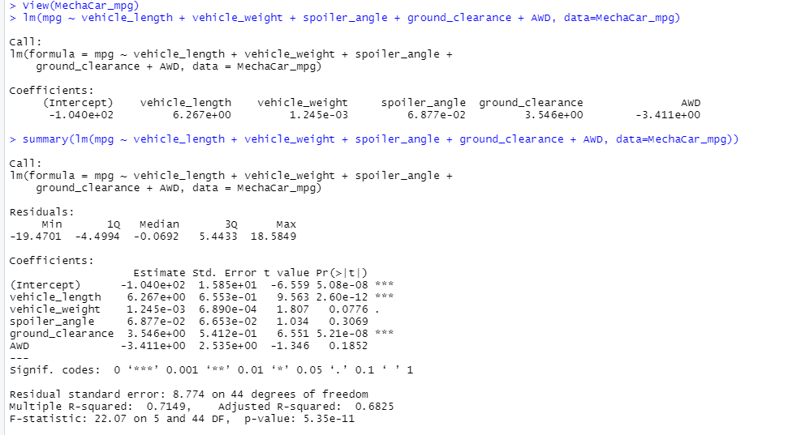

# MechaCar Statistical Analysis
 The data analytics team at AutosRUs are conducting a special project on the production of the MechaCar, AutosRUs' newest prototype. 
 The team will:
  - perform a multiple linear regression analysis 
  - collect summary statistics on the pounds per square inch (PSI) of suspension coils from the manufacturing lots
  - run t-tests to determine if the manufacturing lots are different from the mean population
  - Design a statistical study to compare vehicle performance of the MechaCar to other manufacturer's vehicles. 
  
Resources:
  - MechaCar_mpg.csv
  - Suspension_Coil.csv
  - RStudio
 
## Linear Regression to Predict MPG
and write a short summary using a screenshot of the output from the linear regression, and address the following questions:

 - Vehicle length and ground clearance provide non-random variance; vehicle length has a p-value of 2.60e-12 and ground clearance has a p-value of 5.21e08. 
 - Vehicle weight, spoiler angle, and AWD has p-values that show random variance. 
 - The slope of the model cannot be considered zero. This is because the p-value is 6.712e-11, it is less than zero and therefore the slope cannot be zero.
 - The R-squared value is 71.19%. The model predicts prototypes effectively 71% of the time. 

## Summary Statistics on Suspension Coils

- The design specifications for the MechaCar suspension coils dictate that the variance of the suspension coils must not exceed 100 pounds per square inch. 
- In total, the data meets this criteria at 62.29 PSI according to the variance.  
- Looking at the lot summary, Lot 3 surpases the rate at 170.28 PSI. 

## T-Tests on Suspension Coils 
### One Sample t-test 

- The inital t-test shows the sample mean is not statistically different from the population mean. With a p-value of 0.06.

-Further analysis into the Manufacturing Lots shows that Lot 1 and 2 are not statistically different from the population mean. Lot 3 is statistically different with a p-value of 0.04, whereas the population mean has a p-value of 0.06. Lot 3's mean of x is also different from Lots 1 and 2; the mean of x is 1496.14 and Lot 1 and 2 have mean of x's at 1500.

## Study Design: MechaCar v Competition
To provide our consumers with a robust analysis of MechaCar's performance against the competition, another study must be conducted. We must consider cost, city and highway fuel efficiency, maintenance cost, and safety rating. 

The null hypothesis is that MechaCar's metrics are not significantly different from the competitions. The alternate hypothesis is that MechaCar's metrics are significantly different from the competitions.

To test this hypothesis we will use a one-tailed t-test. We want to see if MechaCar is higher or lower in values versus the competition. Consumers look for lower cost and maintenance cost, as well as higher city and highway fuel efficiency and safety rating. 

Running these tests requires data on MechaCar's cost, fuel efficiency, maintenance cost, and safety rating. The same data is required from MechaCar's competition.
